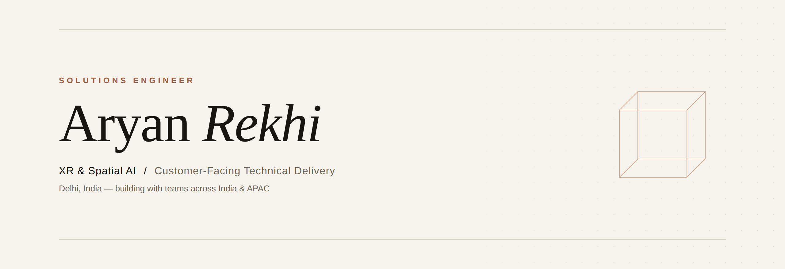

  

&nbsp;
&nbsp;

 

I help Fortune-500 and government organizations turn immersive **XR and Spatial AI** technology into deployed, working solutions — from technical discovery and live executive demos through architecture, QA, and rollout.

Currently a **Solutions Engineer at EON Reality**, working at the intersection of customers, product, and engineering across India & APAC.

 

### Selected work

&nbsp;&nbsp;**—**&nbsp;&nbsp; Led solutions engineering for an XR & Spatial AI platform across enterprise and government accounts

&nbsp;&nbsp;**—**&nbsp;&nbsp; Ran a 2-day train-the-trainer programme enabling 5 skill centres to build XR independently · 92% positive feedback

&nbsp;&nbsp;**—**&nbsp;&nbsp; Demonstrated the platform live to a state Chief Minister at a training-centre launch

&nbsp;&nbsp;**—**&nbsp;&nbsp; Supported a flagship government deployment serving 170,000+ learners

&nbsp;&nbsp;**—**&nbsp;&nbsp; Built AI object-detection models improving recognition accuracy ~20%

 

### Tooling

&nbsp;
&nbsp;
&nbsp;
&nbsp;
&nbsp;
&nbsp;

 

### Selected projects

&nbsp;&nbsp;**Neural Style Transfer** &nbsp;·&nbsp; Python, PyTorch &nbsp;—&nbsp; dilated-CNN pipeline, ~12% faster processing

&nbsp;&nbsp;**Symphony Stitch** &nbsp;·&nbsp; Unity, Photon, C# &nbsp;—&nbsp; multiplayer co-op built to study player retention

&nbsp;&nbsp;**Senso** &nbsp;·&nbsp; Unity, C# &nbsp;—&nbsp; action game with adaptive enemy AI and dynamic inventory

 

### Education

&nbsp;&nbsp;**B.Tech, Computer Science** — Bennett University · CGPA 8.82 / 10 · scholarship every semester

 

Open to remote Solutions Engineer / Customer Success Engineer roles with US & EU teams.

